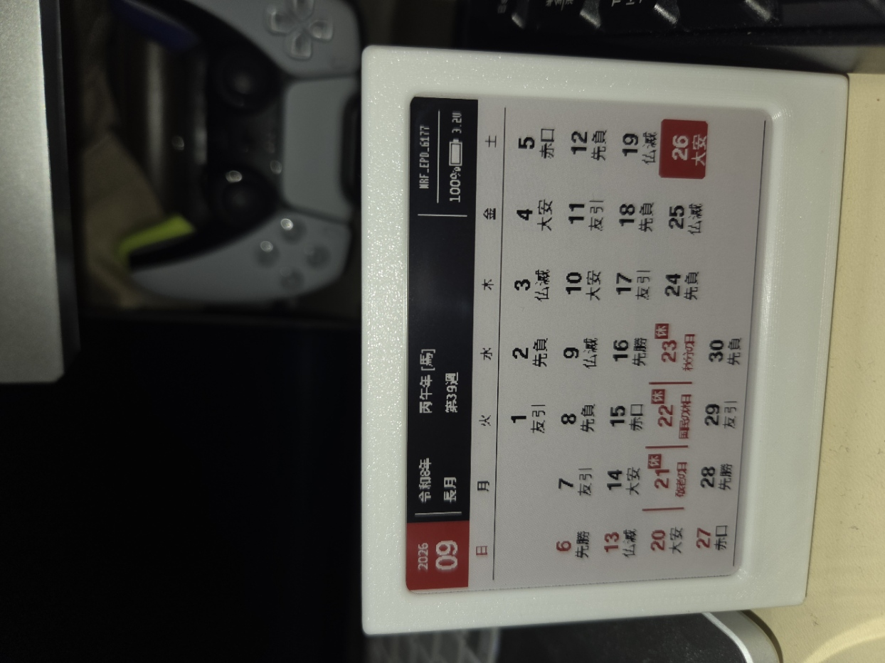

# EPD-nRF5-JP — Japanese Edition

**日本向け電子ペーパーカレンダーの独立 fork。** [tsl0922/EPD-nRF5](https://github.com/tsl0922/EPD-nRF5) を基に、日本の暦表示と、このリポジトリで管理する Web Bluetooth コントローラーを追加しています。中国語版への機能追加ではなく、日本向けのファームウェアと Web UI を一緒に開発するプロジェクトです。

[简体中文说明](README.zh-CN.md) · [対応デバイス](docs/devices.md) · [開発資料](docs/develop.md) · [ビルドと OTA の詳細](docs/jp-build-ota.md)

## 主な機能

- 月間カレンダー、和暦、六曜、日本の祝日・振替休日・国民の休日。
- 週の開始曜日を **日曜日（初期値）／月曜日** から選択。設定はブラウザーではなくデバイス側に保存します。
- 既存の時計・画像表示、画像転送、低消費電力動作を継承。
- `html/` の Web Bluetooth コントローラーで接続、時刻同期、表示モード切り替え、画像転送、週初めの読出し・変更が可能。
- nRF52811 向けのコマンドラインビルドと、アプリケーション専用 DFU ZIP の生成。

日本の祝日計算には 2019–2021 年の特例も含みます。春分・秋分は 1980–2099 年向けの近似式を使うため、将来の正式な日付が公表された場合は確認・更新が必要です。

## 使用している電子ペーパー端末

このプロジェクトで使用している端末は **nRF52811** 搭載、**4.2 インチ・400×300 ピクセル・白黒赤の 3 色電子ペーパー**です。画面ドライバーは **UC8176**、ファームウェアの画面モデル ID は **`03`** です。`0x1d` 以降の nRF52811 向け初期設定も、この組み合わせに合わせています。端末に保存済みの画面モデル設定がある場合は、その値が優先されます。

実機の表示例（2026 年 9 月）：



## Web コントローラー

Web Bluetooth コントローラーは、このリポジトリの [`html/`](html/) に含まれています。各自の PC でローカルサーバーを起動して使用してください（Windows CMD）：

```cmd
cd /d C:\path\to\EPD-nRF5-JP
python -m http.server 8000 --directory html
```

Chrome または Edge で <http://localhost:8000/> を開き、Bluetooth で端末に接続します。`0x1d` 以降の JP ファームウェアでは接続時に設定を読み、カレンダー／時計モードで端末時刻が 60 秒を超えてずれていれば自動同期して画面を更新します。必要に応じて「カレンダーモード」を選択すると、時刻同期と再描画を手動でも実行できます。

Web UI は **DFU クライアントではありません**。OTA 更新には nRF5 SDK Secure DFU に対応したアプリを使用します。

## nRF52811 ファームウェアのビルド

対象は Nordic nRF5 SDK 17.1.0 / S112 7.3.0 / `nRF52811_xxAA` です。Arm GNU Embedded 10.3-2021.10 を用いる Windows CMD の例：

```cmd
cd /d C:\path\to\EPD-nRF5-JP
python tools\build_nrf52811.py --toolchain C:\path\to\gcc-arm-none-eabi-10.3-2021.10
python tools\package_nrf52811_ota.py build\nrf52811\EPD-nRF52811-JP.hex
```

生成物は `build/nrf52811/` に保存されます。`EPD-nRF52811-JP-ota.zip` は**アプリケーション専用**の BLE DFU パッケージです。`EPD-nRF52811-JP-full.hex` は SoftDevice・Bootloader・設定を含む開発用イメージであり、スマートフォンからの OTA に使うファイルではありません。パッケージ作成時にはアプリケーションのアドレス範囲 `0x19000–0x25FFF` を検査します。

## Android からの OTA 更新

1. 上記のビルドを実行し、`build/nrf52811/EPD-nRF52811-JP-ota.zip` を Android スマートフォンにコピーします。ZIP は展開しません。
2. Nordic Semiconductor の [nRF Device Firmware Update（Android）](https://play.google.com/store/apps/details?id=no.nordicsemi.android.dfu) をインストールし、Bluetooth を有効にします。
3. Web コントローラーなど、端末との既存の Bluetooth 接続を切断します。アプリで対象端末を選び、コピーした `-ota.zip` を指定して DFU を開始します。
4. アプリが更新完了を表示し、端末が再起動するまで待ちます。その後、ローカルの Web コントローラーへ接続し、ファームウェアバージョンと画面モデル `03` を確認します。

スマートフォンからの OTA には**アプリケーション専用の `-ota.zip`** を使用します。`-full.hex` は選択しません。DFU パッケージは端末の Bootloader の署名鍵・SoftDevice と一致する必要があります。

## BLE 設定と互換性

| コマンド | 内容 |
| --- | --- |
| `0x20` | 時刻と表示モードを設定 |
| `0x21 0x00/0x01` | 週の開始曜日を日曜／月曜に変更 |
| `0x22` | 現在の設定を通知で読み出し |
| `0x01 <model>` | 画面モデルを初期化・保存 |

既存のコマンド値と GATT UUID は維持しています。週初めはデバイスの 13 バイト設定の最後の 1 バイトで、FDS に保存します。`html/` は接続時にデバイスから設定を読み、ブラウザーの localStorage を正本にはしません。

ホスト側のカレンダーテストは C コンパイラーと `make test` で実行できます。Web UI の静的ファイル検査は `python tests/test_pages_assets.py` で実行できます。

## ライセンスと謝辞

本 fork は [GPL-3.0](LICENSE) に従います。原作者の功績を保持し、[ZinggJM/GxEPD2](https://github.com/ZinggJM/GxEPD2)、[Waveshare e-Paper](https://github.com/waveshareteam/e-Paper)、[ATC_TLSR_Paper](https://github.com/atc1441/ATC_TLSR_Paper) を参照しています。
